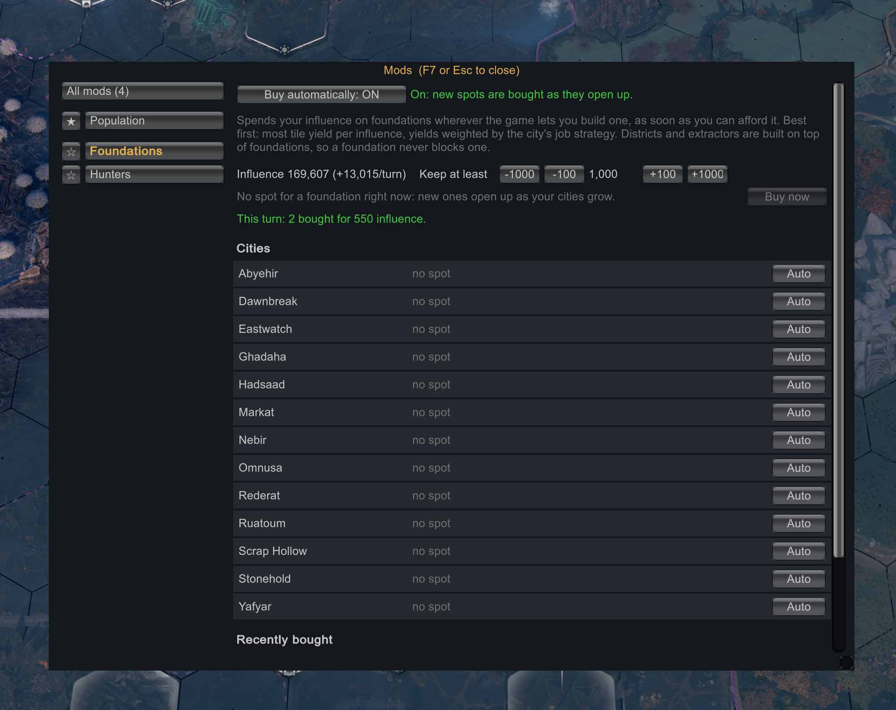

# Auto Foundations for ENDLESS Legend 2

> [!TIP]
> **Enjoying Auto Foundations?** If it saves you some clicking and you like my work, you can
> [sponsor me on GitHub](https://github.com/sponsors/JavierOrtegaP). It's completely optional, but always appreciated,
> and it keeps me making more mods. Thank you! ❤️
>
> 

A [BepInEx](https://github.com/BepInEx/BepInEx) mod that spends your spare influence on foundations for you, so you
don't have to look for free foundation tiles and click each one every turn.

## What it does

Wherever the game would let you build a foundation, the mod buys one with the game's own "build foundation" order, as
soon as it opens up, as long as your influence stays above the amount you keep (1,000 by default). Free foundations
(right next to an administrative district) are always taken.

- **Best spots first**: when influence is short, the mod picks the most tile yield per influence, the yields weighted
  by each city's job strategy (Balanced / Food / Industry / Science).
- **Nothing is blocked**: districts and extractors are built on top of foundations, and foundations don't make
  districts more expensive (the game's district cost counts real districts only).
- **Same rules as a click**: the mod uses the game's own checks and prices; spots a quest reserves are skipped. For
  factions whose foundations also cost dust or resources (some custom factions), those spots are left to you.

A short notice at the top of the screen can tell you when foundations were bought (off by default; switch it on in
the window).

## The window (Mod Menu page, or the `` ` `` key)

With [Mod Menu](https://github.com/JavierOrtegaP/el2-mod-menu) installed (optional), its key (F7) lists a
**Foundations** page and the `` ` `` key is not used; without it, the `` ` `` key (left of 1) opens the mod's own
window. Both show the same:

- **Buy automatically: ON/OFF**, and how much influence to keep.
- **Buy now**: buys every spot you can afford right away, also when automatic buying is off.
- Spots and their cost per city, with a per-city **Auto/Off** switch (saved per game).
- What was bought recently, with each tile's yields.

## Install

1. Install **BepInEx 5** for Windows x64 (tested with
   [5.4.23.5](https://github.com/BepInEx/BepInEx/releases/tag/v5.4.23.5)): extract it into the game folder (the folder
   with `Endless Legend 2.exe`), so that `winhttp.dll` sits next to the game's exe. Start the game once.
2. Extract `AutoFoundations-<version>.zip` into the same folder. The mod ends up in `BepInEx/plugins/AutoFoundations/`.
3. Load a game. Press F7 (with Mod Menu) or `` ` `` to open it.

If nothing happens, check `BepInEx/LogOutput.log` for `Auto Foundations ... active`.

To uninstall, delete `BepInEx/plugins/AutoFoundations` (and, if you like,
`BepInEx/config/el2.autofoundations.cfg` and `BepInEx/config/AutoFoundations/`). The mod only gives the
game its own orders, so saves don't depend on it.

## Options

Saved in `BepInEx/config/el2.autofoundations.cfg`; the first two are also in the window.

| Option | Default | |
| --- | --- | --- |
| General / AutoBuy | true | Buy foundations automatically. |
| General / KeepInfluence | 1000 | Only spend influence above this. |
| Window / ToggleKey | Backquote | Unity Input System key name; not used while Mod Menu is installed. The game uses F1-F6 and F8-F11. |
| Window / ShowNotice | false | Notice at the top of the screen when foundations are bought (also in the window). |
| Window / Size | 0 | 0 = follows the screen resolution (2x at 4K); else a multiplier. |
| Window / Opacity | 1 | Window background opacity. |
| Debug / LogPurchases | true | Log every foundation bought to `BepInEx/LogOutput.log`. |

## Compatibility

- Made for ENDLESS Legend 2 **1.0** (Steam build 25623753). If an update breaks one of its hooks, that part switches
  itself off and the log says so.
- Tested in single player. Multiplayer is untested.
- Works alongside [Mod Menu](https://github.com/JavierOrtegaP/el2-mod-menu),
  [Population Planner](https://github.com/JavierOrtegaP/el2-population-planner) and
  [District Planner](https://github.com/AndKenneth/el2-district-planner).

## How it works

- Spots are found on the game's simulation thread, right after the game copies its state for its own UI, with the
  game's own `CanBuildFoundationAt` and `GetFoundationInfluenceCostAt`; nothing in the simulation is modified directly.
- Purchases go through `OrderBuildFoundationAt`, the order a click on a foundation tile sends, a few per frame; an
  order the game doesn't carry out is retried, then that spot is left until the next turn.

## Building

Needs the .NET SDK (7 or newer) and the game installed: the project compiles against the game's own assemblies, which
are not part of this repository. Tell the build where the game is with a `local.props`
(`<Project><PropertyGroup><GameDir>D:\...\ENDLESS Legend 2</GameDir></PropertyGroup></Project>`), the `EL2_GAME_DIR`
environment variable, or `-p:GameDir=...` (default: Steam's standard install path). BepInEx's DLLs come from the game
folder if BepInEx is installed there, else from `.cache/bepinex/BepInEx/core`. `dotnet build -c Release` builds,
copies the DLL into the game (when BepInEx is installed; `-p:SkipDeploy=true` to skip) and writes
`dist/AutoFoundations-<version>.zip`.

Tests for the choice of spots: `dotnet run --project tests/AutoFoundationsTests.csproj`.

## License

[MIT](LICENSE). Not affiliated with or endorsed by Amplitude Studios.
